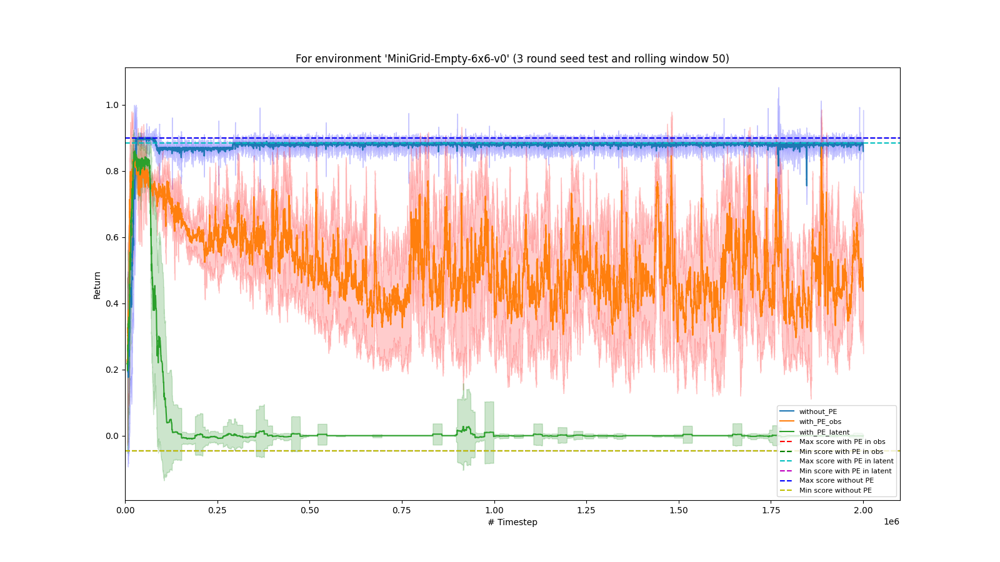
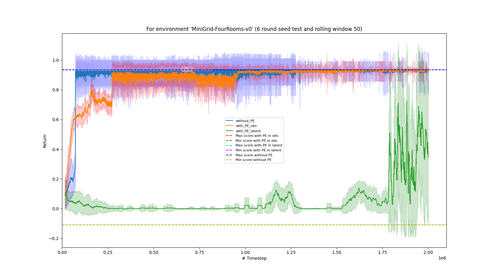

# ELEC0054-Embedding-Positional-Encoding-into-DQN

## Abstract

The Deep Q-Network (DQN) model has become a popular tool in the rapidly evolving reinforcement learning domain. This study investigates whether incorporating positional encoding (conveying temporal information) into the DQN model can enhance the learning process in POMDPs. This study evaluates the effectiveness of positional encoding in enhancing DQN's performance within the MiniGrid environment, specifically addressing the challenge of aliasing states—where distinct states appear similar but have different underlying characteristics. This issue is a notable challenge in learning in POMDPs. Specifically, we tested two environments: Empty, with fewer degrees of aliasing states and FourRooms, with higher degrees of aliasing states. Experiments showed that the baseline DQN without PE performed best in Empty. In FourRooms, DQN with added PE at the observation level showed promising results, suggesting potential benefits from capturing temporal information. When PE was added to the latent space, performance suffered in both environments. While promising, the findings are preliminary and further research is needed to validate the efficacy of PE-augmented DQN in addressing aliasing states.

## Requirement

Please see the environment.yml file

## Resutls

For MiniGrid-Empty:

For MiniGrid-FourRooms:

